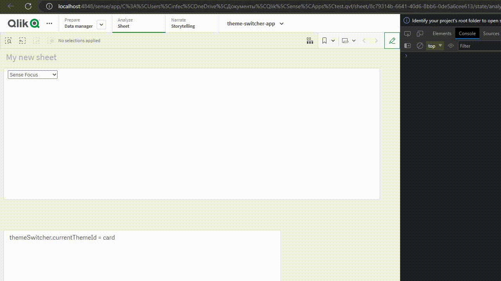

# Main

# req

- ext install esbenp.prettier-vscode

# .env

EXTENSION_PATH - path to Extension folder. For example C:\Users\USERNAME\Documents\Qlik\Sense\Extensions\theme-switcher

# steps

- npm i
- edit .env
- npm run link
